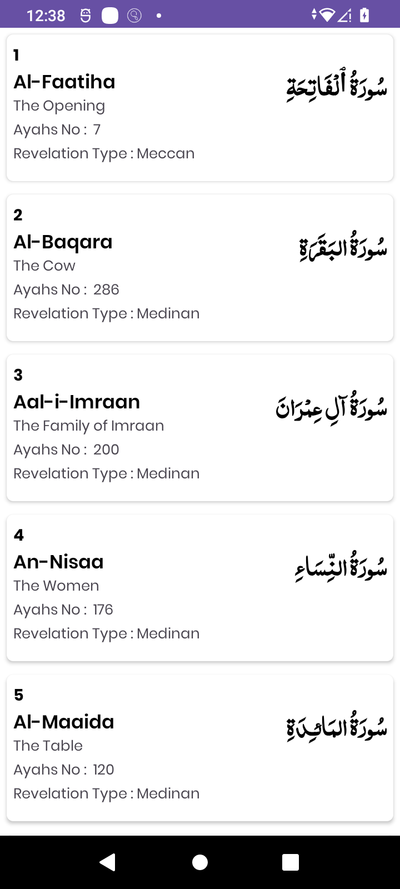

# Al-Quran

Al-Quran is an app used to recite Quran. It is made using https://alquran.cloud/ API and implemented MVVM pattern. With this app user can recite quran, check current ruku, manazil, surah revelation, Juz and much more.

# Screenshots

  

## Don't Forget to Star ⭐

If you found this project useful or had fun exploring it, please consider giving it a star. It's a great way to show your appreciation and it puts a smile on my face! 😊🌟

